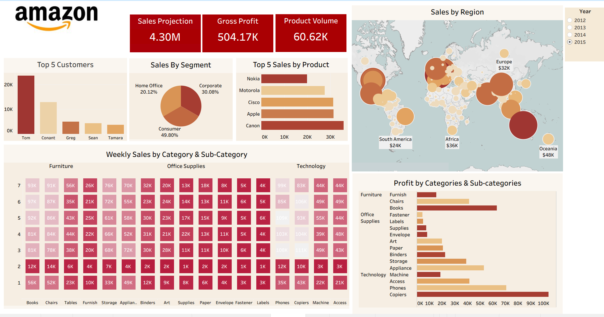

# 📊 Amazon Global Sales Dashboard – Tableau Project

## 🧩 Overview

This project presents an **interactive Tableau Sales Dashboard** built using the [Amazon Global Sales Dataset](https://www.kaggle.com/datasets/shashwatrahangdale/amazon-global-sales-dashboard).  
It provides a comprehensive view of sales performance across multiple regions and product categories between **2012 and 2015**, allowing decision-makers to analyze revenue, profit, and product trends effectively.

The dashboard is designed to help a **mid-sized e-commerce company (Amazon-like)** improve its sales operations and strategy through **data-driven insights**.

---

## 🚀 Features

✅ **Interactive KPIs** — View Total Sales, Gross Profit, Product Volume, and Profit Margin dynamically by year.  
🗺️ **Regional Insights** — Map visualization showing global sales distribution and profit by region.  
📅 **Time Series Analysis** — Track monthly sales and profit trends to identify seasonal demand.  
📦 **Top 5 Products & Customers** — Analyze the top-performing products and customers driving sales.  
🧱 **Category Profitability** — Bar charts comparing profit across categories and sub-categories.  
🔥 **Weekly Heatmap** — Visualize weekly sales intensity by product category.  
🧭 **Dynamic Filtering** — Filter by Year, Category, Region, and Segment.  
🎛️ **Parameter Controls & Sets** — Toggle between years (2012–2015) and highlight selected insights.  
📈 **Hierarchies** — Drill down Region → Country → State and Category → Sub-Category → Product.

---

## 🏗️ Dashboard Composition

| Visualization          | Description                                                               |
| ---------------------- | ------------------------------------------------------------------------- |
| **KPI Cards**          | Display Total Sales, Total Profit, Product Units Sold, and Profit Margin. |
| **Map Chart**          | Sales by Region with color encoding for profit margin.                    |
| **Time Series Chart**  | Monthly trend of Sales and Profit.                                        |
| **Donut Chart**        | Market share of each sales segment.                                       |
| **Bar Charts**         | Top 5 Products and Top 5 Customers based on sales value.                  |
| **Heatmap**            | Weekly sales trend by category and sub-category.                          |
| **Profit by Category** | Profit comparison across product categories.                              |

---

## 🧮 Dataset Information

**Source:** [Amazon Global Sales Dataset – Kaggle](https://www.kaggle.com/datasets/shashwatrahangdale/amazon-global-sales-dashboard)  
**Type:** Historical transactional sales data (2012–2015)

**Added Derived Columns for Tableau:**

- `order_year` → Extracted from `order_date`
- `order_month` → Extracted from `order_date`
- `delivery_days` → Difference between `ship_date` and `order_date`
- `profit_margin` → `(Profit / Sales) * 100`
- `avg_order_value` → `(Sales / Quantity)`

These transformations were done in **Python (pandas)** before importing into Tableau.

---

## 🎯 Key KPIs

| KPI                | Description                         |
| ------------------ | ----------------------------------- |
| **Total Sales**    | Overall revenue for selected period |
| **Gross Profit**   | Total profit earned                 |
| **Product Volume** | Total quantity of items sold        |

|
